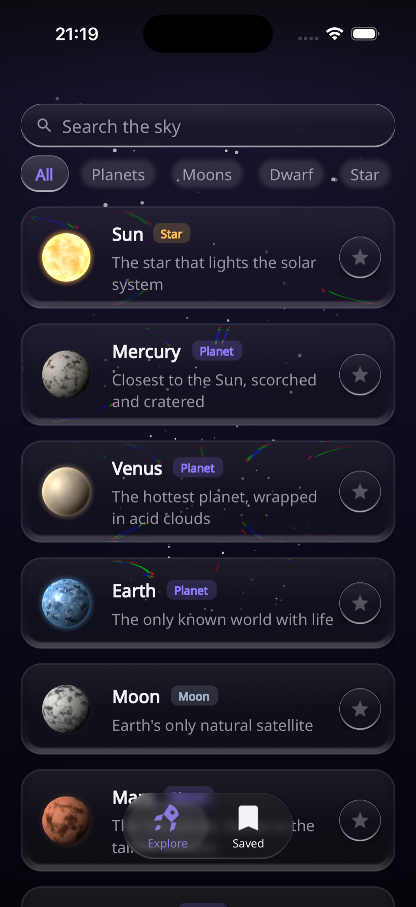
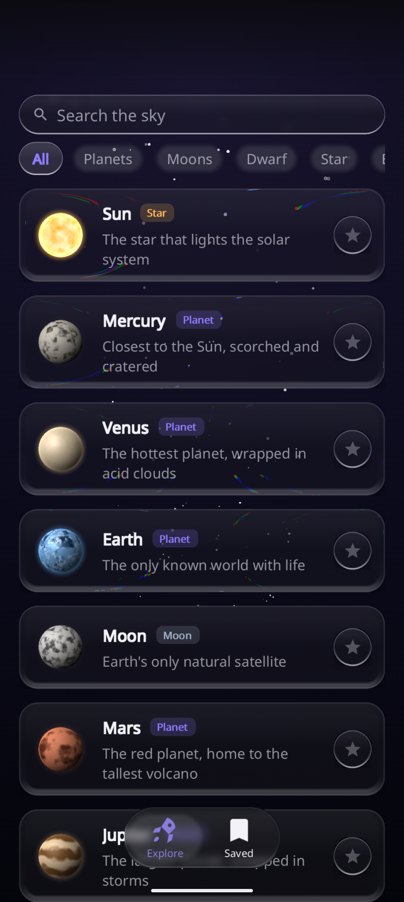

# Showcase Cranpose

**Live demo:** <https://samoylenkodmitry.github.io/cranpose-showcase/>

Showcase Cranpose is a liquid-glass 3D star chart built with
[Cranpose](https://github.com/samoylenkodmitry/cranpose). One Rust codebase
ships to desktop, Android, iOS, and the web.

<table>
<tr>
<td align="center"><b>iOS</b></td>
<td align="center"><b>Android</b></td>
</tr>
<tr>
<td></td>
<td></td>
</tr>
</table>

## What it demonstrates

- Liquid Glass surfaces with zero material blur, refraction, a pinned
  blurred-gradient crown, and a floating tab bar.
- A procedural WGSL planet shader with lighting, atmosphere, terrain, cloud,
  and ring variants.
- Compose-style state, keyed lazy lists, scroll-linked parallax, transitions,
  and platform safe-area handling.

## Run locally

```bash
# Desktop
cargo run --features desktop,renderer-wgpu,logging

# Web
./build-web.sh
cd dist && python3 -m http.server 8080

# Android
(cd android && ./gradlew :app:assembleDebug -PshowcaseAbi=arm64-v8a)

# iOS Simulator
./ios/run-sim.sh
```

## Releases

Tag `vX.Y.Z` when the Cargo, Android, and iOS versions match. GitHub Actions
publishes Linux, macOS, Windows, Android, and iOS artifacts and deploys the
web demo to GitHub Pages.

## License

Apache-2.0. See [LICENSE](LICENSE).
